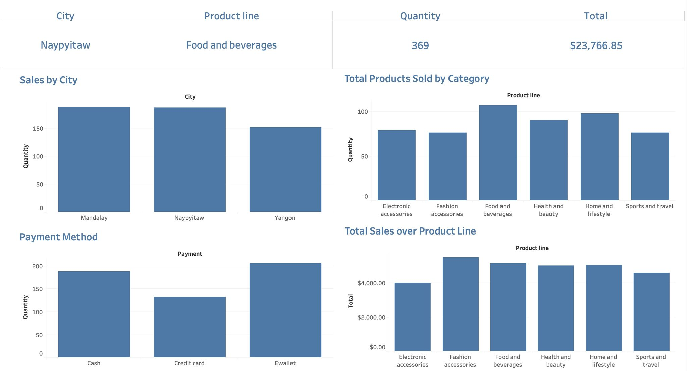
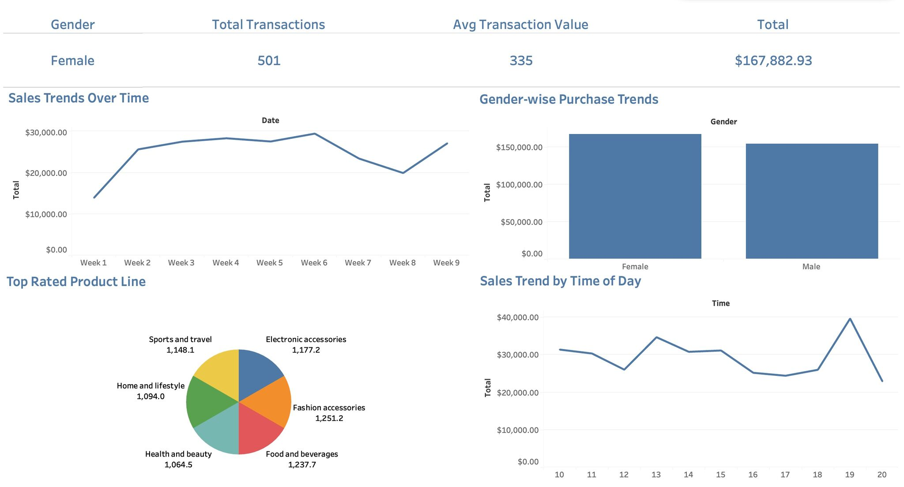

# Supermarket Sales Intelligence Dashboard

An interactive Tableau dashboard analysing supermarket sales performance 
across three cities, built to uncover revenue trends, customer behaviour, 
product category insights, and payment patterns.

## Tools & Technologies Used

- Tableau
- Excel / CSV

## Dataset

- 1,000 supermarket transactions across 3 cities: Mandalay, Naypyitaw, 
  and Yangon
- Covers 6 product lines, 3 payment methods, and customer gender data
- Includes date, time, quantity, and revenue fields

## Dashboard 1 — Sales Trends & Customer Behaviour

**KPIs tracked:**
- Total Transactions: 501 (Female customers)
- Average Transaction Value: $335
- Total Revenue: $167,882.93

**Visualisations:**
- Sales Trends Over Time (weekly, Week 1–9)
- Gender-wise Purchase Trends (Female vs Male revenue comparison)
- Top Rated Product Line (pie chart across 6 categories)
- Sales Trend by Time of Day (hourly revenue from 10am–8pm)

## Dashboard 2 — City, Product & Payment Analysis

**KPIs tracked:**
- Top City: Naypyitaw | Top Product Line: Food and Beverages
- Quantity: 369 | Revenue: $23,766.85

**Visualisations:**
- Sales by City (Mandalay, Naypyitaw, Yangon)
- Total Products Sold by Category
- Total Sales over Product Line (revenue by category)
- Payment Method breakdown (Cash, Credit Card, Ewallet)

## Key Insights

- Fashion Accessories had the highest average product rating (1,251.2), 
  followed by Food & Beverages (1,237.7) and Electronic Accessories 
  (1,177.2)
- Sales peaked at 7pm, with a notable dip mid-afternoon
- Mandalay and Naypyitaw outperformed Yangon in quantity sold
- Ewallet was the most frequently used payment method, followed by Cash
- Female and Male customers showed comparable total revenue, with 
  Female slightly higher
- Food & Beverages led in both quantity sold and total revenue across 
  product lines

## Dashboard Preview

### Dashboard 1 — Sales Trends & Customer Behaviour

### Dashboard 2 — City, Product & Payment Analysis

## Project Goal

To transform raw supermarket transactional data into an interactive 
BI dashboard that enables business stakeholders to monitor KPIs, 
identify sales patterns, and make data-driven decisions across cities, 
product lines, and customer segments.

## Author

Dheepsaran Vivekananth
- LinkedIn: linkedin.com/in/dheepsaran-vivekananth-1aa3b2151
- GitHub: github.com/dheepsaranv
