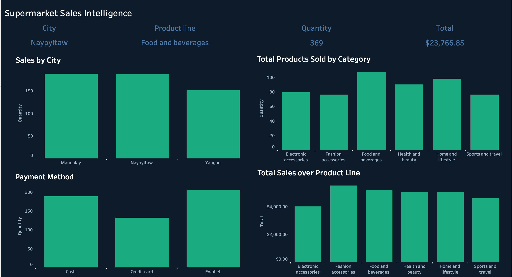

# Supermarket Sales Intelligence Dashboard

An interactive, multi-dashboard Tableau solution built to analyse supermarket sales performance, customer behaviour, product category trends, and revenue KPIs — transforming raw transaction data into actionable business intelligence.

---

## 🔗 Live Dashboard

**[View on Tableau Public →](https://public.tableau.com/app/profile/dheepsaran.vivekananth/viz/Supermarket-SalesAnalysis/Dashboard1#2)**

---

## Business Context

A retail business with branches across three cities needs to understand which locations, product lines, customer segments, and payment methods are driving revenue — and where sales are being lost. This solution was built to answer those questions through a clean, interactive BI dashboard that a management team can use daily.

---

## Tools & Technologies

| Tool | Purpose |
|---|---|
| Tableau | Dashboard design, visualisation, interactivity |
| SQL | Data cleaning and transformation |
| Excel / CSV | Raw data source and preprocessing |

---

## Dashboard Overview

### Dashboard 1 — Supermarket Sales Intelligence

Focuses on sales volume and revenue across cities, product lines, and payment methods.


**Charts included:**
- **KPI Summary Bar** — Top city, product line, total quantity sold, and total revenue at a glance
- **Sales by City** — Quantity comparison across Mandalay, Naypyitaw, and Yangon
- **Payment Method** — Transaction volume breakdown by Cash, Credit Card, and E-wallet
- **Total Products Sold by Category** — Quantity comparison across 6 product lines
- **Total Sales over Product Line** — Revenue comparison across all product categories

---

### Dashboard 2 — Sales & Customer Analytics

Focuses on customer behaviour, gender-based purchasing patterns, time-based sales trends, and product ratings.



**Charts included:**
- **KPI Summary Bar** — Gender filter, total transactions, average transaction value, and total revenue
- **Sales Trends Over Time** — Weekly revenue trend across the full dataset period
- **Gender-wise Purchase Trends** — Revenue comparison between Female and Male customer segments
- **Top Rated Product Line** — Horizontal bar chart of product lines ranked by customer rating
- **Sales Trend by Time of Day** — Hourly revenue pattern identifying peak trading hours

---

## Key Insights

- **Naypyitaw** is the highest revenue-generating city ($110,569) ahead of Yangon ($106,200) and Mandalay ($106,198)
- **Food and Beverages** is the top product line by revenue ($56,145) and second highest by quantity sold (952 units)
- **Electronic Accessories** leads in quantity sold (971 units) across all product lines
- **E-wallet** is the most used payment method (345 transactions), narrowly ahead of Cash (344)
- **Female customers** generated higher total revenue ($167,883) compared to Male ($155,084)
- **Food and Beverages** has the highest average customer rating (7.11), followed by Fashion Accessories (7.03)
- **Health and Beauty** is the lowest revenue category ($49,194) — an opportunity for targeted promotions
- Total revenue across all branches: **$322,967** from **1,000 transactions** with an average transaction value of **$322.97**

---

## Approach

1. Cleaned and structured 1,000 raw supermarket transactions using SQL and Excel for consistent analysis across branches and time periods
2. Designed a two-dashboard Tableau solution with a consistent dark navy theme and teal colour palette for professional presentation
3. Built interactive KPI summary bars at the top of each dashboard for at-a-glance metric visibility
4. Applied dashboard-level action filters enabling cross-chart filtering by clicking any data point
5. Structured charts to answer specific business questions — sales by location, by time, by customer segment, and by product line

---

## Dataset

| Field | Detail |
|---|---|
| Source | Supermarket Sales Dataset (publicly available) |
| Period | January – March 2019 |
| Records | 1,000 transactions |
| Branches | 3 cities — Mandalay, Naypyitaw, Yangon |
| Total Revenue | $322,966.75 |
| Avg Transaction | $322.97 |

**Fields:** Invoice ID, Branch, City, Customer Type, Gender, Product Line, Unit Price, Quantity, Tax, Total, Date, Time, Payment, COGS, Gross Margin, Gross Income, Rating

---

## Project Structure

```
supermarket-sales/
├── Supermarket-Sales Analysis.twb   # Tableau workbook
├── supermarket_sales.csv            # Raw dataset
├── Dashboard_1.png                  # Sales Intelligence dashboard screenshot
├── Dashboard_2.png                  # Customer Analytics dashboard screenshot
└── README.md                        # Project documentation
```

---

## About

Built by **Dheepsaran Vivekananth** — Data Analyst with 4.5 years of experience in Power BI, Tableau, SQL, and Python.

- 🔗 [LinkedIn](https://linkedin.com/in/dheepsaran-vivekananth-1aa3b2151)
- 💻 [GitHub](https://github.com/dheepsaranv)
- 📊 [Upwork](https://www.upwork.com/freelancers/~01c5a70f744873f01f)
- 📧 vdheepsaran@gmail.com
